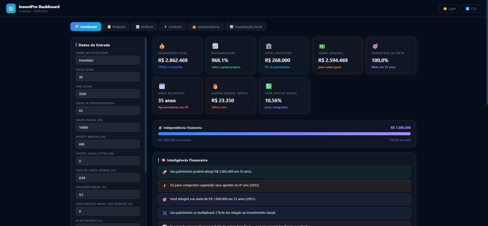

# InvestPro Dashboard

Simulador de investimentos e aposentadoria, gratuito e sem cadastro. Projeta o crescimento do patrimônio com juros compostos, inflação, cenários diferentes e renda estimada na aposentadoria.

Este repositório é uma vitrine do projeto. O código-fonte é privado.

🔗 Demo ao vivo: [em breve]

## O que o app faz

- Calcula patrimônio final com juros compostos e inflação
- Painel com indicadores principais: total investido, juros gerados, rentabilidade, progresso da meta de independência financeira
- Projeção ano a ano, gráficos, comparação de cenários e simulação de aposentadoria
- Gera insights automáticos sobre a evolução do patrimônio
- Exporta os dados em CSV e em PDF
- Tema claro e escuro

## Tecnologias

JavaScript, com Chart.js pros gráficos e geração de PDF direto no navegador.

## Status

No ar, com plano de monetização por anúncios.

---
Projeto pessoal desenvolvido por [João Batista](https://github.com/SHUON23).
